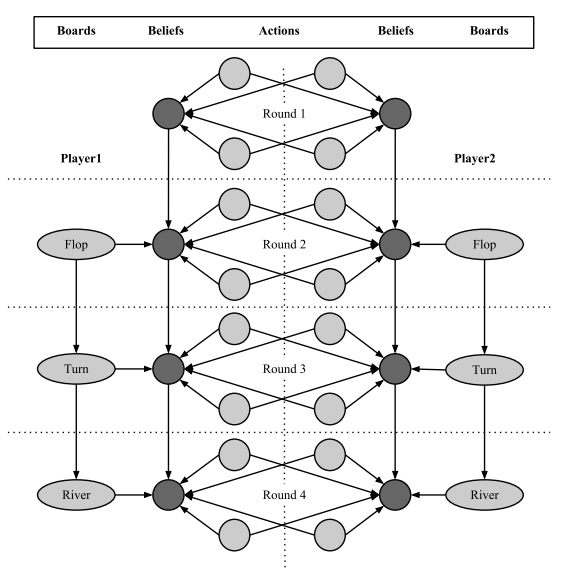
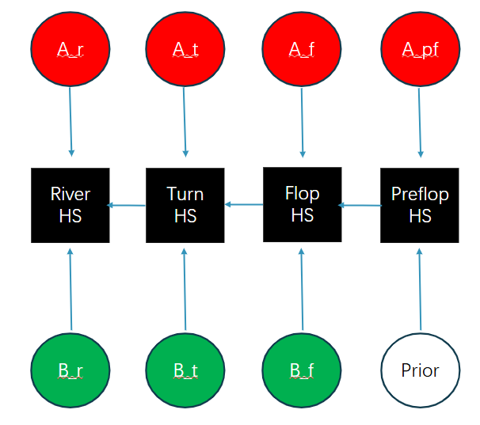

## \newpage

```{r setup, include=FALSE}
knitr::opts_chunk$set(echo = TRUE)
```

## Research Objective

the objective of this research as a whole is to investigate Bayesian techniques implemented into the entertainment industry. We decided to narrow the scope of this project with a focus of poker. We decided on the topic of using likelihood estimation in poker to optimize winning strategies. We stumbled upon the concept of Bayesian Networks for this research, and we will be discussing this further throughout the paper.

## Introduction

Texas Hold'em is probably one of the best-known forms of poker and has attracted considerable interest in developing tools for making inferences about the game. With numerous card combinations and varying player strategies, decision making can be challenging. To assist with this, one possible method is to use Bayesian networks to analyze the probabilities in a Texas Hold’em game. Bayesian networks serve as a powerful tool for dealing with uncertainty in the game, allowing us to continually update our beliefs based on new information observed in each round, including cards in hand, community cards revealed, and opponent behaviors. The goal is to make optimal betting decisions and maximize the expected returns.

**Overview of Key Rules in Texas Hold’em**

For clarity, we summarize the basic rules (Texas hold 'em, 2025): Each player has two hole cards that remain hidden from their opponents. Five community cards are dealt face-up and shared by all players. The game begins with each player receiving two private cards. Then there are four rounds of betting, where the community cards are gradually revealed: pre-flop, flop (the first three cards), turn (the fourth card), and river (the fifth card). If two or more players remain after the final betting round, the game proceeds to a showdown, where players reveal their private cards and determine the winner. During each betting round, players can choose from several actions: bet (place an opening bet), check (bet nothing), raise (increase the size of an existing bet), call (match the current bet or raise), fold (discard hand and exit the round). The strength of a player’s hand is determined by the best five-card combination they can make using their two hole cards and the five community cards.

Listed below are all the following combinations after the river and hole cards are revealed, ranked from weakest to strongest in terms of value/strength.

| Name            | Description                                           |
|-----------------|-------------------------------------------------------|
| High Card       | No combination but cards of high value (e.g. A and K) |
| Pair            | Two cards of the same value.                          |
| Two-Pair        | Two different pairs                                   |
| Three of a Kind | Three cards of the same value.                        |
| Straight        | Five consecutive cards                                |
| Flush           | Five cards of the same suit                           |
| Full House      | Three of a kind and a pair                            |
| Four of a Kind  | Four cards of the same value                          |
| Straight Flush  | Five consecutive cards of the same suit               |
| Royal Flush     | Straight flush consisting of 10, J, Q, K, A           |

## Preliminary Data Analysis

In order to fully understand what kind of data would be useful for us to incorporate into a Bayesian Network, we performed a preliminary data analysis on a data-set compiled by the University of Alberta's Computer Poker Research Group. The specific data-set used was from the Internet Relay Chat (IRC) poker server. We used stratified sampling on **three** groups: $holdem$, $holdem2$, and $holdem3$ and examined all of the data from May 2000 for these groups. IRC groups were split by experience (moderated through having win-rate requirements) and betting pool sizes. $holdem$ is a group that contains new but enthusiastic players who are familiar with the rules of Texas Hold'em poker, but aren't quite proficient yet. $holdem2$ contains players who have met the win-rate requirements and are willing to bet more money. $holdem3$ has the least amount of players, but everyone who plays in those games have high skill and the starting bets are the highest among the IRC games.

```{r message=FALSE, warning=FALSE}
library(tidyverse)
library(ggplot2)

filenames <- list.files("data/holdem")
full_paths <- paste("data/holdem", filenames, sep="/")
all_data <- lapply(full_paths, function(x) {
  read.table(x, header = FALSE, fill = TRUE, stringsAsFactors = FALSE)
})
max_cols <- max(sapply(all_data, ncol))
all_data_char <- lapply(all_data, function(df) {
  for(i in 1:ncol(df)) {
    df[,i] <- as.character(df[,i])
  }
  return(df)
})

games1 <- bind_rows(all_data_char)

games_with_preflop_1 <- games1 %>% 
  filter(V8 != "-") %>%
  filter(!is.na(V12), !is.null(V12), V12 != "") %>%
  mutate(rank12 = substr(V12, 1, 1)) %>%
  mutate(rank13 = substr(V13, 1, 1)) %>%
  mutate(suit12 = substr(V12, 2, 2)) %>%
  mutate(suit13 = substr(V13, 2, 2)) %>%
  mutate(preflop = case_when(
    rank12 == rank13 & suit12 != suit13 ~ "Off-Suited Pair",
    rank12 != rank13 & suit12 == suit13 ~ "Suited Non-Pair",
    rank12 != rank13 & suit12 != suit13 ~ "Off-Suited Non-Pair"
  )) %>%
  mutate(wins = case_when(
    V11 > 0 ~ "# WINS",
    TRUE ~ "# LOSSES"
  )) %>%
  select(wins, preflop) 
```

```{r echo=FALSE, warning=FALSE}
filenames <- list.files("data/holdem2")

full_paths <- paste("data/holdem2", filenames, sep="/")

all_data <- lapply(full_paths, function(x) {
  read.table(x, header = FALSE, fill = TRUE, stringsAsFactors = FALSE)
})

max_cols <- max(sapply(all_data, ncol))

all_data_char <- lapply(all_data, function(df) {
  for(i in 1:ncol(df)) {
    df[,i] <- as.character(df[,i])
  }
  return(df)
})

games2 <- bind_rows(all_data_char)

games_with_preflop_2 <- games2 %>% 
  filter(V8 != "-") %>%
  filter(!is.na(V12), !is.null(V12), V12 != "") %>%
  mutate(rank12 = substr(V12, 1, 1)) %>%
  mutate(rank13 = substr(V13, 1, 1)) %>%
  mutate(suit12 = substr(V12, 2, 2)) %>%
  mutate(suit13 = substr(V13, 2, 2)) %>%
  mutate(preflop = case_when(
    rank12 == rank13 & suit12 != suit13 ~ "Off-Suited Pair",
    rank12 != rank13 & suit12 == suit13 ~ "Suited Non-Pair",
    rank12 != rank13 & suit12 != suit13 ~ "Off-Suited Non-Pair"
  )) %>%
  mutate(wins = case_when(
    V11 > 0 ~ "# WINS",
    TRUE ~ "# LOSSES"
  )) %>%
  select(wins, preflop) 
```

```{r echo=FALSE, warning=FALSE}
filenames <- list.files("data/holdem3")

full_paths <- paste("data/holdem3", filenames, sep="/")

all_data <- lapply(full_paths, function(x) {
  read.table(x, header = FALSE, fill = TRUE, stringsAsFactors = FALSE)
})

max_cols <- max(sapply(all_data, ncol))

all_data_char <- lapply(all_data, function(df) {
  for(i in 1:ncol(df)) {
    df[,i] <- as.character(df[,i])
  }
  return(df)
})

# Combine all dataframes
games3 <- bind_rows(all_data_char)

games_with_preflop_3 <- games3 %>% 
  filter(V8 != "-") %>%
  filter(!is.na(V12), !is.null(V12), V12 != "") %>%
  mutate(rank12 = substr(V12, 1, 1)) %>%
  mutate(rank13 = substr(V13, 1, 1)) %>%
  mutate(suit12 = substr(V12, 2, 2)) %>%
  mutate(suit13 = substr(V13, 2, 2)) %>%
  mutate(preflop = case_when(
    rank12 == rank13 & suit12 != suit13 ~ "Off-Suited Pair",
    rank12 != rank13 & suit12 == suit13 ~ "Suited Non-Pair",
    rank12 != rank13 & suit12 != suit13 ~ "Off-Suited Non-Pair"
  )) %>%
  mutate(wins = case_when(
    V11 > 0 ~ "# WINS",
    TRUE ~ "# LOSSES"
  )) %>%
  select(wins, preflop) 
```

For the sake of space, code to import data from holdem2 and holdem3 have been omitted from this compiled report. However, the code for those is nearly identical.

### Pre-Flop to Showdown Analysis

I first examined the chance of winning a showdown given the two hands a player is dealt at the pre-flop stage. This is to see if luck of the draw plays a significant part in win rates. In our research, we determined that different hands can be “bucketed” into categories to reduce the total number of hand combinations and make analysis more efficient. For a starting hand, the buckets are **“Suited Non-Pair”** (same suit, different rank), **“Off-Suited Pair”** (different suit, same rank), and **“Off-Suited Non-Pair”** (different suit, different rank).

```{r echo=FALSE,warning=FALSE}
library(gridExtra)
library(patchwork)
library(stringr)
preflop1 <- ggplot(games_with_preflop_1, aes(x = wins, fill = preflop)) +
  geom_bar(position = "dodge") +
  labs(
    title = str_wrap("Number of Wins per Pre-Flop Hand (holdem group)", width = 15),
    x = "Wins",
    y = "Count",
    fill = "Preflop Hand"
  ) +
  theme_minimal()
  
preflop2 <- ggplot(games_with_preflop_2, aes(x = wins, fill = preflop)) +
  geom_bar(position = "dodge") +
  labs(
    title = str_wrap("Number of Wins per Pre-Flop Hand (holdem2 group)", width = 15),
    x = "Wins",
    y = "Count",
    fill = "Preflop Hand"
  ) +
  theme_minimal()

preflop3 <- ggplot(games_with_preflop_3, aes(x = wins, fill = preflop)) +
  geom_bar(position = "dodge") +
  labs(
    title = str_wrap("Number of Wins per Pre-Flop Hand (holdem3 group)", width = 15),
    x = "Wins",
    y = "Count",
    fill = "Preflop Hand"
  ) +
  theme_minimal()
combined_plot1 <- preflop1 + preflop2 + preflop3 +
  plot_layout(ncol = 3, guides = "collect") & 
  theme(legend.position = "bottom", aspect.ratio = 1.5)


preflop11 <- ggplot(games_with_preflop_1, aes(x = wins, fill = preflop)) +
  geom_bar(position = "stack") +
  labs(
    title = str_wrap("Total Wins/Losses per Pre-Flop Hand (holdem group)", width = 15),
    x = "Wins",
    y = "Count",
    fill = "Preflop Hand"
  ) +
  theme_minimal()

preflop22 <- ggplot(games_with_preflop_2, aes(x = wins, fill = preflop)) +
  geom_bar(position = "stack") +
  labs(
    title = str_wrap("Total Wins/Losses per Pre-Flop Hand (holdem2 group)", width = 15),
    x = "Wins",
    y = "Count",
    fill = "Preflop Hand"
  ) +
  theme_minimal()

preflop33 <- ggplot(games_with_preflop_3, aes(x = wins, fill = preflop)) +
  geom_bar(position = "stack") +
  labs(
    title = str_wrap("Total Wins/Losses per Pre-Flop Hand (holdem3 group)", width = 15),
    x = "Wins",
    y = "Count",
    fill = "Preflop Hand"
  ) +
  theme_minimal()
combined_plot2 <- preflop11 + preflop22 + preflop33 +
  plot_layout(ncol = 3, guides = "collect") & 
  theme(legend.position = "bottom", aspect.ratio = 1.5)
#combined_plot1 / combined_plot2 + plot_layout(ncol = 1)

combined_plot1
combined_plot2

#combined <- (preflop1 | preflop2 | preflop3) / (preflop11 | preflop22 | preflop33) + 
#  plot_layout(guides = "collect") +  # Collect all legends
#  plot_annotation(theme = theme(legend.position = "top", aspect.ratio = 2))
#combined
```

In the least experienced groups, players seem to have more reliance on the dealt hand to win because wins/losses are least consistent in the worst dealt hand, the off-suited non-pair. Meanwhile, the most experienced group seems to know how to handle the off-suited non-pair hands, whether it's by bluffing or finding a good final hand with a straight. This could also imply that more experienced players know when to fold to minimize their losses.

The rarest starting hand, the pair, seems to generally allow players to win more than they lose, which means that the starting hand *can* help a player win a showdown, but as seen in the difference between newer players and experienced players, good poker players will also be able to make the most out of a bad starting hand. Do note that this data analysis does not include any folds that occurred, and only analyzes showdowns (where both players show their hand, with the stronger one being the winner). Furthermore, we don't have the numbers of the bets nor the pools, which means that some of these losses could just be to improve the credibility of their bluffs. There could be further analysis to be performed on how often good players fold versus how often newer players fold, and whether that has an effect on the win rate. We could also analyze how often good players bluff, what kind of bluffs they perform, and how effective these bluffs are for improving win rate.

For now, let's examine the frequency of play (folding vs calling) among the different groups to see if it contributes to win rate.

### Frequency of Play Analysis

```{r echo=FALSE, warning=FALSE}
filenames <- list.files("data/holdemtest")
full_paths <- paste("data/holdemtest", filenames, sep="/")
all_data <- lapply(full_paths, function(x) {
  read.table(x, header = FALSE, fill = TRUE, stringsAsFactors = FALSE)
})

max_cols <- max(sapply(all_data, ncol))

all_data_char <- lapply(all_data, function(df) {
  for(i in 1:ncol(df)) {
    df[,i] <- as.character(df[,i])
  }
  return(df)
})

gamestest <- bind_rows(all_data_char)

games_fold_bet_1 <- games3 %>% 
  filter(!is.na(V3), !is.null(V3), V3 != "") %>%
  mutate(turn_folded = case_when(
    V5 == "-" ~ "Pre-Flop",
    V6 == "-" ~ "Flop",
    V7 == "-" ~ "Turn",
    V8 == "-" ~ "River",
    TRUE ~ "Didn't Fold"
  )) %>%
  mutate(bet = as.numeric(V10)) %>%
  select(V5, V6, V7, V8, bet, turn_folded)

games_played_hands_1 <- games1 %>%
  filter(!is.na(V3), !is.null(V3), V3 != "") %>%
  mutate(player = as.character(V1)) %>%
  group_by(player)%>%
  mutate(did_fold = case_when(
    V8 == "-" ~ 1,
    TRUE ~ 0
  )) %>%
  summarize(
    N = n(),
    num_folded = sum(did_fold),
    num_played = N-num_folded,
    proportion_played = num_played/(num_played+num_folded),
    start_bankroll = as.numeric(first(V9[which.min(as.numeric(V2))])),
    end_bankroll = as.numeric(first(V9[which.max(as.numeric(V2))])),
    got_money = case_when(
      start_bankroll-end_bankroll >= 0 ~ 1,
      TRUE ~ 0
    )
  )

games_played_hands_2 <- games2 %>%
  filter(!is.na(V3), !is.null(V3), V3 != "") %>%
  mutate(player = as.character(V1)) %>%
  group_by(player)%>%
  mutate(did_fold = case_when(
    V8 == "-" ~ 1,
    TRUE ~ 0
  )) %>%
  summarize(
    N = n(),
    num_folded = sum(did_fold),
    num_played = N-num_folded,
    proportion_played = num_played/(num_played+num_folded),
    start_bankroll = as.numeric(first(V9[which.min(as.numeric(V2))])),
    end_bankroll = as.numeric(first(V9[which.max(as.numeric(V2))])),
    got_money = case_when(
      start_bankroll-end_bankroll >= 0 ~ 1,
      TRUE ~ 0
    )
  )

games_played_hands_3 <- games3 %>%
  filter(!is.na(V3), !is.null(V3), V3 != "") %>%
  mutate(player = as.character(V1)) %>%
  group_by(player)%>%
  mutate(did_fold = case_when(
    V8 == "-" ~ 1,
    TRUE ~ 0
  )) %>%
  summarize(
    N = n(),
    num_folded = sum(did_fold),
    num_played = N-num_folded,
    proportion_played = num_played/(num_played+num_folded),
    start_bankroll = as.numeric(first(V9[which.min(as.numeric(V2))])),
    end_bankroll = as.numeric(first(V9[which.max(as.numeric(V2))])),
    got_money = case_when(
      start_bankroll-end_bankroll >= 0 ~ 1,
      TRUE ~ 0
    )
  )
```

```{r echo=FALSE, warning=FALSE}
freq1 <- ggplot(games_played_hands_1, aes(x=proportion_played))+
  geom_histogram(bins=100)+
  coord_cartesian(xlim = c(0, 1))+
  labs(
    title = str_wrap("Histogram of How Common a Played Hand/Total 
                     Hands Ratio is in holdem group", width = 15),
    x = str_wrap("Proportion of Played Hand/Total Hands", width = 15),
    y = "Count"
  ) +
  theme_minimal()
freq2 <- ggplot(games_played_hands_2, aes(x=proportion_played))+
  geom_histogram(bins=100)+
  coord_cartesian(xlim = c(0, 1))+
  labs(
    title = str_wrap("Histogram of How Common a Played Hand/Total 
                     Hands Ratio is in holdem2 group", width = 15),
    x = str_wrap("Proportion of Played Hand/Total Hands", width = 15),
    y = "Count"
  ) +
  theme_minimal()
freq3 <- ggplot(games_played_hands_3, aes(x=proportion_played))+
  geom_histogram(bins=100)+
  coord_cartesian(xlim = c(0, 1))+
  labs(
    title = str_wrap("Histogram of How Common a Played Hand/Total 
                     Hands Ratio is in holdem3 group", width = 15),
    x = str_wrap("Proportion of Played Hand/Total Hands", width = 15),
    y = "Count"
  ) +
  theme_minimal()
freq1 <- freq1 + theme(plot.margin = margin(0.1,0.1,0.1,0.1, "cm"))
freq2 <- freq2 + theme(plot.margin = margin(0.1,0.1,0.1,0.1, "cm"))
freq3 <- freq3 + theme(plot.margin = margin(0.1,0.1,0.1,0.1, "cm"))
combined_plot <- freq1 + freq2 + freq3
combined_plot
```

As experience increases, the desire to play hands tend to decrease, and the charts between less experienced players and the most experienced players have clear differences. It seems then, that we can assume the decision-making has a big part in how good of a poker player you are.

From our preliminary data analysis, we can determine with a decent amount of certainty that the decisions made between experienced players and new players have significant difference. While Texas Hold'em poker has an element of luck, good players seem to find more consistent winnings by being smart with their playing strategy. When to fold, when to raise, how to bluff, etc., are considerations that a good player should be making when playing the game. Therefore, if a model is to be theoretically considered for this game, we should find a way to include all of these parameters that should influence our decision.

To do this, our research has concluded that one way to do this is by using Hidden Markov Models (HMMs), which is a time series analysis that helps us model opponents’ strategies over time and infer their hand strength based on their aggressiveness in betting compared to their hand strength, their tendency to fold, and other such patterns. However, we found that we can also perform such analyses through Bayesian Networks, so we will primarily focus on those. The variables and charts that we already examined are examples of possible variables that can be included in a Bayes net. With many variables and lots of observations of an opponent, we should be able to model their behaviour and improve our poker strategy.

## Further Analysis: Bayesian Inference impacting Decisions

Poker is a game where players have incomplete information at each phase of the game, making it necessary to make strategic choices without knowing much about their opponents’ cards or intentions. Information is vital in these games unlike games like chess, where all the information is laid out. Poker is filled with uncertainty, bluffs, and the need the underlying conditional probabilities. Players have to read betting patterns, gauge odds, and adjust their betting strategy as new information comes to light.

To make better decisions when facing uncertainty, we can use computational models like Bayesian Networks and Hidden Markov Models (HMMs). These models provide a structured approach to uncover hidden information, such as how strong an opponent's hand might be or their typical behavior. We aim to explore how Bayesian Networks and HMMs can be applied in poker and show how they can improve a player's strategy. Bayesian Networks are acyclic graphs that represent causation of conditional probabilities. In poker, these variables can include a player's actions, the community cards on the table, and hidden factors like hand strength. By mapping out these relationships, a Bayesian Network helps players make informed guesses based on the evidence they see. In poker, a Bayesian Network usually includes three types of nodes. Action nodes, Belief nodes, and Board nodes.

Bayesian Networks apply Bayes’ Theorem, which helps the model adjust beliefs about hidden factors when new information comes in. In poker, players can apply this theorem to update their thoughts on an opponent’s hand strength after noticing their betting patterns. This involves figuring out the initial probability of an event, evaluating how likely the observed action is, and then determining the updated probability.

Bayes’ Theorem is key to how Bayesian Networks work, helping players adjust their beliefs based on new information. In this context, the prior probability reflects the initial assumption about a variable, like the strength of an opponent's hand, before any actions are taken. The likelihood represents the chance of seeing a specific action, such as a bet, if the opponent has a certain type of hand. Once an action is observed, Bayes’ Theorem helps calculate the posterior probability, which gives the updated belief about the opponent’s hand strength.

{width="369"}

The above pictures are from ***Using Bayesian Networks to Model a Poker Player*****, (Andrew Heiberg, UCSD)**

To illustrate this in a real game, let’s take a heads-up match in Texas Hold 'Em. One player has Queen of Spades and Eight of Clubs as their hole cards. The community cards that come out during the flop, turn, and river are 6 of Spades, 7 of Spades, 10 of Clubs, and Jack of Diamonds. With this setup, the player could complete a straight if the final card turns out to be an 8 or 9.

In this situation, the opponent has been raising aggressively all through the hand and now makes a big bet on the river. Considering their past moves and style of play, the player figures there’s a 70 percent chance that the opponent has a strong hand, like a straight or flush, and a 30 percent chance that they might be bluffing or holding something weak.

To figure out how to react to this bet, the player thinks about Bayes’ Theorem to adjust their beliefs. Let’s say there’s an 85 percent chance that the opponent would make a big bet if they had a strong hand. On the other hand, if the opponent has a weak hand, the chance of them making that same big bet drops to 40 percent.

Using Bayes’ Theorem, the player works out the updated probability that the opponent is holding a strong hand based on what’s happened so far:

\begin{align}
P(\text{Heavy Bet})&=P(\text{Heavy Bet}\mid\text{Strong Hand})*P(\text{Strong Hand})+P(\text{Heavy Bet}\mid\text{Weak Hand})*P(\text{Weak Hand})\\&=(0.85\times0.7)+(0.4\times0.3)\\&=0.715
\end{align}
\begin{align}
P(\text{Strong Hand}\mid\text{Heavy Bet})&=\frac{P(\text{Heavy Bet}\mid\text{Strong Hand})*P(\text{Strong Hand})}{P(\text{Heavy Bet})}\\&=\frac{0.85*0.7}{0.715}\approx0.833
\end{align}

The updated belief is that there’s an 83.3% chance the opponent has a strong hand. This change in perspective impacts how the player decides to act. If the opponent has a strong hand, they may be holding a straight or a flush, leading to their win. In that scenario, folding could be the best move. However, if the player still thinks there’s a chance the opponent is bluffing—despite the high likelihood of a strong hand—they might decide to call or even raise, depending on how much risk they’re willing to take and their overall strategy.

In poker, hidden states could reflect a player’s underlying strategy, like whether they’re bluffing, playing it safe, or being aggressive. For instance, if someone often raises before the flop but tends to fold afterward, the model might suggest that they’re likely bluffing before the flop. Even though you can’t see these states directly, you can pick up on their influence by looking at the actions a player takes over several rounds.

## In-Depth Bayesian Network Structure and Inference

A simple way to explain how poker can use Bayesian Inference is to model an opponent’s playstyle using a Bayesian Network. Implementing the above, we first define our Nodes. We will only be implementing a Bayesian Network that models Opponent Hand Strength, but a BN that networks the game better will have several more nodes and be more suited for post-game analysis. For the sake of this paper, we will be showing a simpler example of a 1v1 Texas Hold'em Poker scenario. Let's have 4 action nodes, one for each phase of a poker round. Now in each one of these phases, the opponent may bet/raise, call, check, fold. The preflop you may call, raise, and fold. Our belief nodes will be nodes that represent hand strength at each state of the game (3 Belief Buckets of Strong Medium and Weak for efficiency purposes). We can use Bayes inference to dynamically update our belief of the opponent's hand strength. Let board cards be the cards revealed to the table each phase. Our final BN for poker is designed to infer hidden game states that help us make better decisions against our opponents. We use betting actions to calculate whether our opponent has a strong hand or not, and we can also predict their next round based on known betting tendencies or strategies. The edges of the Bayesian Network represent conditional probabilities. These conditional probabilities change as evidence updates. Bucketing comes into play by simplifying the network via grouping similar values, as the poker state space is massive (instead of focusing on “7-2 pair” vs “Pocket Aces”, we can group them by non-suited non-pairs and non-suited pairs).

{width="326"}

The above is the BN Structure, where the arrows show causal effect of conditional probabilities. The 4 nodes in the middle row represent Hand strength (denoted HS) of each phase of the game. The top row are the action nodes, and the bottom board nodes of each phase (3/4/5 community cards revealed) and prior assumption of opponent hand before pre-flop

Let’s go through an example scenario:\

| Phase | Action | Board |
|----------|-------------|---------------------------------------------------|
| Pre-Flop | Raise | N/A |
| Flop | Large Bet | [J of Diamonds, 10 of Diamonds, 9 of Spades] |
| Turn | Small Bet | [J of Diamonds, 10 of Diamonds, 9 of Spades, 3 of Clubs] |
| River | All-in | [J of Diamonds, 10 of Diamonds, 9 of Spades, 3 of Clubs, Q of Diamonds] |

Edges in the BN represent conditional dependencies between our random variables. Each node contains Conditional Probability Tables (CPTs) that specify a node’s distribution given value of parents, and the edges of which nodes influence each other. As the actions of each phase are observed, we obtain likelihood through our CPTs and dynamically update our beliefs of hand strength accordingly using Bayes Rule. In the following example, the beliefs change every phase based on action taken by the opponent in response to the board’s potential for winning combinations. Assume the likelihood Distribution in the CPTs is learned from historical data/observed frequencies, if not then using the Maximum Likelihood Equation.

Given Raise Observed (Marginal Probability is certain as evidence is observed), Likelihood dist. Given by CPT:

\begin{align}
P(A_{pf}=\text{Raise}\mid \text{Prior}=\text{[Strong: 0.7, Medium: 0.5, Weak: 0.1]})
\end{align}

We then apply Bayes Rule as covered by previous section. Post-Preflop HS (rounded): [S: 0.44, M: 0.52, W: 0.04]. In other phases, repeat using new HS beliefs, dynamically changing these HS beliefs. Large Bet given a Flop with high potential of straight and flush means likelihood of Strong Hand. below are the assumed conditional probabilities from CPTs:

\begin{align}
P(A_f = \text{Large Bet}\mid\text{HS},B_f) = \text{[Strong: 0.6, Medium: 0.3, Weak:0.2]}\\
P(A_t = \text{Small Bet}\mid\text{HS},B_t) = \text{[Strong: 0.3, Medium: 0.4, Weak:0.2]}\\
P(A_r = \text{All-in}\mid\text{HS},B_r) = \text{[Strong: 0.7, Medium: 0.2, Weak:0.1]}
\end{align}

rounded HS beliefs for each phase:

-   Flop HS = [Strong: 0.62, Medium: 0.36, Weak: 0.02]

-   Turn HS = [Strong: 0.56, Medium: 0.43, Weak: 0.01]

-   River HS = [Strong: 0.81, Medium: 0.18, Weak: 0.01]

We as the Player should use these hand strength beliefs and incorporate it into our own betting strategies during each phase to minimize our money loss and capitalize on money gain when possible. Of course, there are many limitations to this model. Because the implementation of only 3 belief buckets, we would have a bias towards medium hand strength, resulting in overlapping medium range predictions based on large/small bet​. A better implementation of a BN for poker would require more belief buckets, such as a scale of 1-10 or even more. This would allow better post-game analysis. Another idea is to model opponent play-style as well given the hand strength, frequency of actions, likelihood of bluffing, etc. Our Example only considers Board Texture (potential winning combinations) and Actions to infer hand strength of an opponent's hand, but doesn't take into account the rest of the game well.​ Some other possible implementations of BN that may exist already can be in Poker assistance tools known as Poker RTA (Real Time Assistance) tools. Conceptually, some real time assistance tools may utilize the Bayesian Network to model uncertainty and an algorithm such as Monte Carlo Tree Search Algorithm to simulate these scenarios and value of each scenario.

## Conclusion

By categorizing starting hands (such as pairs, suited non-pairs, and off-suited non-pairs) and through our analysis of IRC Poker data and the application of Bayesian methods or Hidden Markov Models. We demonstrate how data-driven inference can help players better evaluate hand strength and predict opponent actions. For example, we’ve seen that while a strong starting hand offers an advantage, experienced players truly excel by making informed decisions at each betting round. In Bayesian Networks, modeling these actions provides a good estimate of opponents' hand strength and betting strategies that enable us to make decisions better than just mere 'luck of the draw'. This, in turn, integrating tools such as Hidden Markov Models enables us to model the time-dependent dynamics of poker, which keeps the predictions refined and improving. Thus, combined with probabilistic modeling, the better predictions maximize the expected returns from the game.

For the future better model we could incorporate more specialized, complex classification. For instance, overlapping medium-range predictions could be sharpened by distinguishing between large-bet and small-bet scenarios, allowing the model to capture bet sizing nuances. Furthermore, adding more data inputs, such as more precise state observation, live betting trends or larger historical datasets into the mix will further refine and improve the predictive power and decision-making capability.

## References

Heiberg, Andrew. “Using Bayesian Networks to Model a Poker Player.” University of California, San Diego, 2013, <https://cdn.aaai.org/ocs/ws/ws1085/7160-30514-1-PB.pdf.> Accessed 2025 April 9.

Terry, Michael A., and Brian E. Mihok. “A Bayesian Net Inference Tool for Hidden State in Texas Hold'em Poker.” CiteSeerX, <https://citeseerx.ist.psu.edu/document?repid=rep1&type=pdf&doi=59056d41a56b98de49c265d3619881c75621dde0.> Accessed 9 April 2025.

Tretyakov, Konstantin, and Liina Kamm. “Modeling Texas Hold’em Poker Strategies with Bayesian Networks.” University of Tartu, September 2009, <https://kt.era.ee/hw/bayesnets-poker/bayesnets-poker.pdf.> Accessed April 9 2025.

Data for Preliminary Data Analysis: <https://poker.cs.ualberta.ca/irc_poker_database.html>
